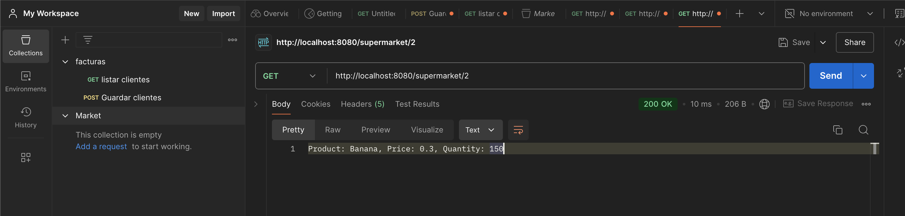
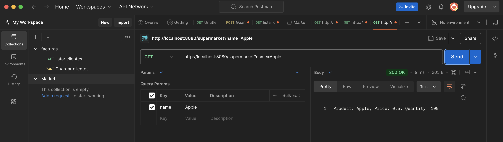
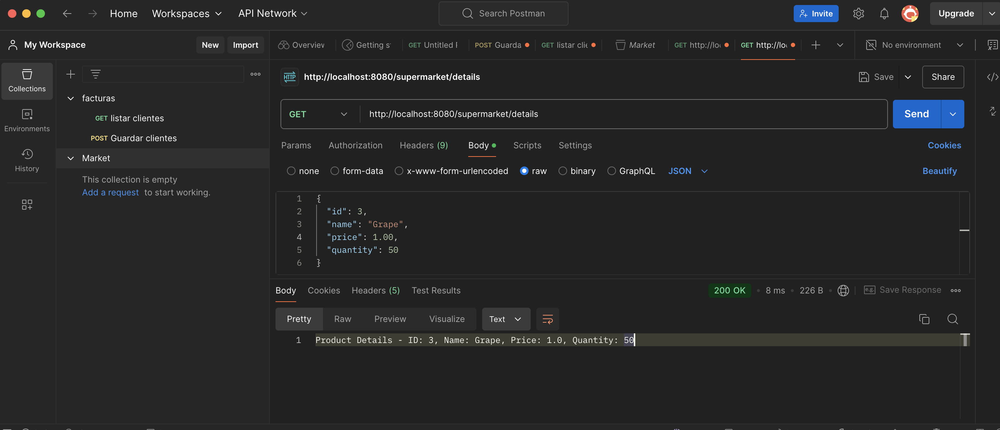

# demo-2
# Supermarket

## 1. PathVariable
  - url:
  ```
  http://localhost:8080/supermarket/2
  ```
  - Captura:




## 2. RequestParam
  - url:
  ```
  http://localhost:8080/supermarket?name=Apple 
  ```
  - Captura:




## 3. RequetBody
  - url:
  ```
  http://localhost:8080/supermarket/details
  ```
  - Captura:




